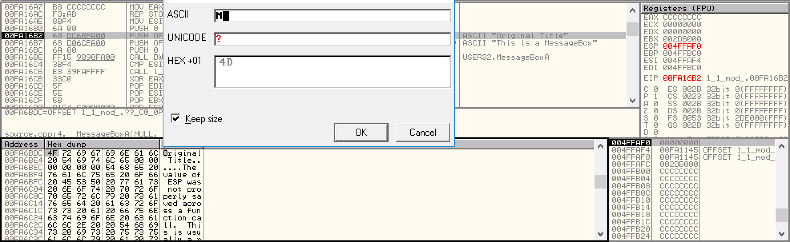

1. First of all, let's create a Visual Studio 2015 C++ project and build it; and the **Character Set** must be Multi-Byte 

2. Open OllyDbg (I use v1.10). Push `F3` to open the `1.1.mod.title.exe` program. I don't know why this alert occurred every time: 

3. Try to find `PUSH 0` command around `MessageBoxA` system call. And read the `OFFSET` value of the second `PUSH` command (here is `00FA6BDC` in the middle region of OllyDbg). Let's jump to the memory `00FA6BDC`: 

4. Finaly, we can edit the memory string directly: 

5. Last but not least, let's press `F9` to finish our process. We can get the *Modifed Title* of MessageBox : 