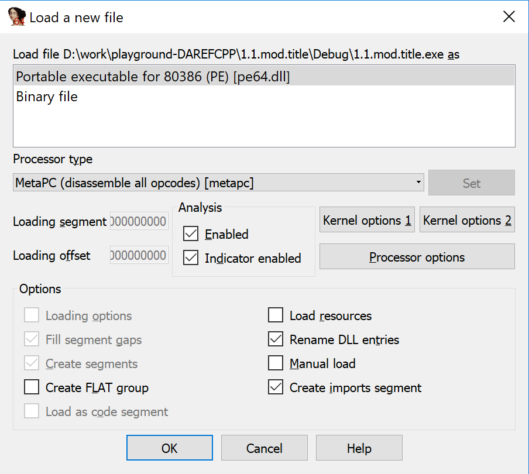
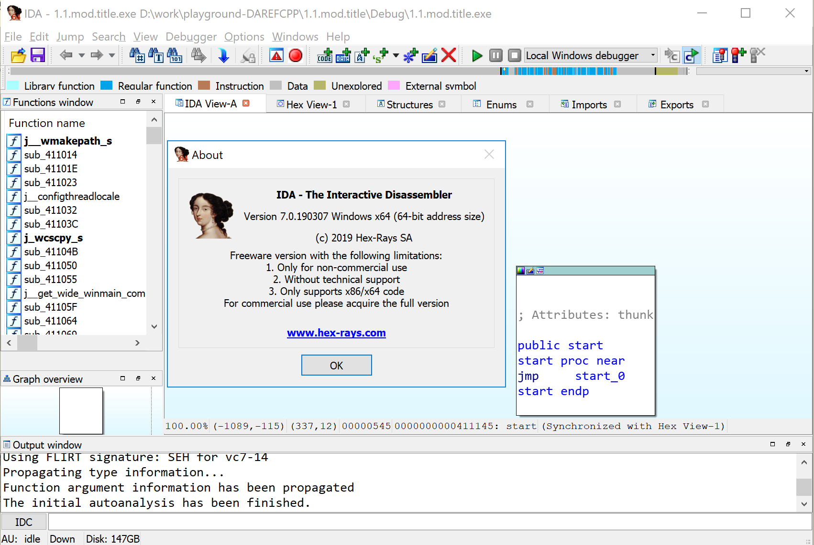
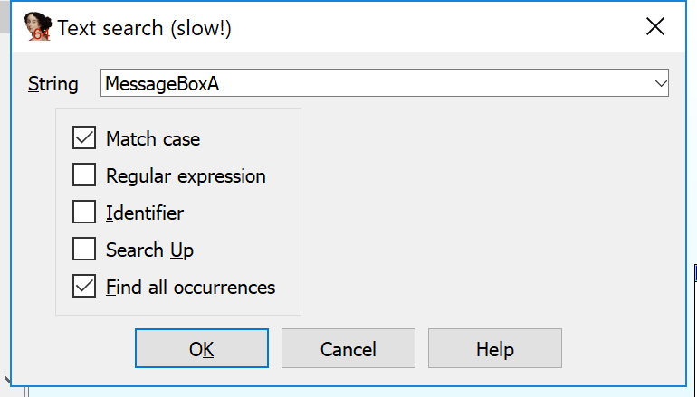
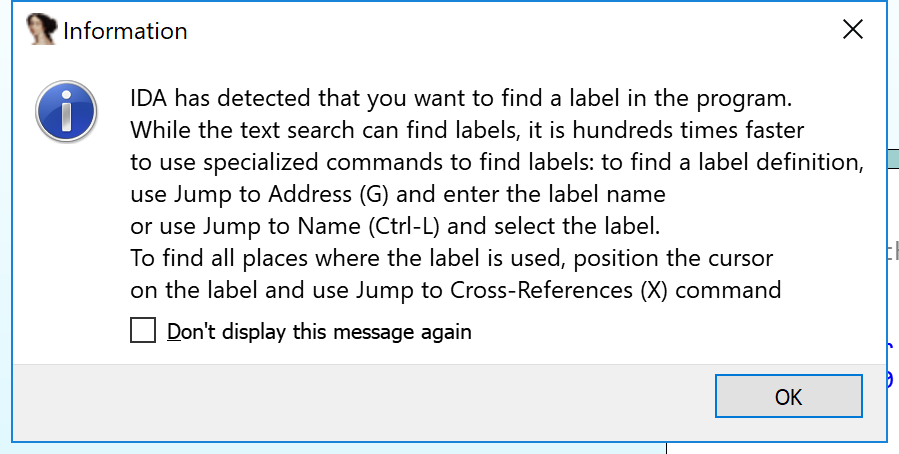
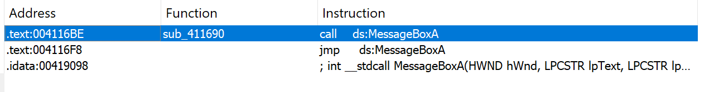
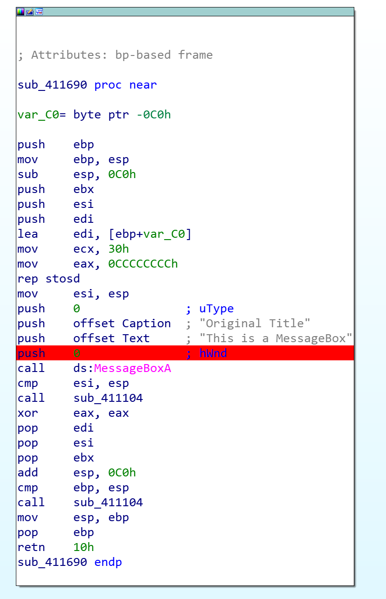

1. Load the `1.1.mod.title.exe` as PE file by IDA (I use [IDA freeware](https://www.hex-rays.com/products/ida/support/download_freeware.shtml) now ) 

2. Now we can see the main view of IDA : 

3. Let's search the function by `Search` menu:  

4. We'll get this information 

5. And here is the result:   ; let's select the first one;

6. We can get the graphic view of our function ;
and we can also press `F2` to set breakpoint before `MessageBoxA` call. Use `F9` to debug(run) it!

#### TODO (make sig file)

