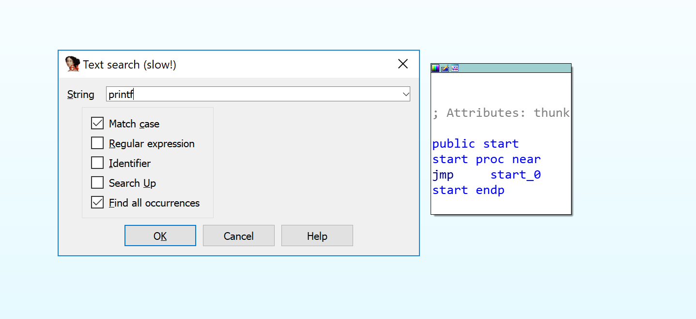
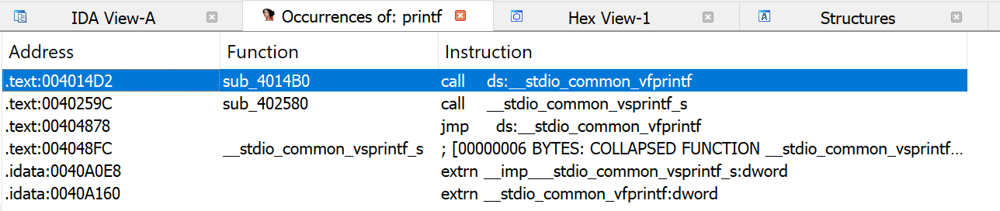
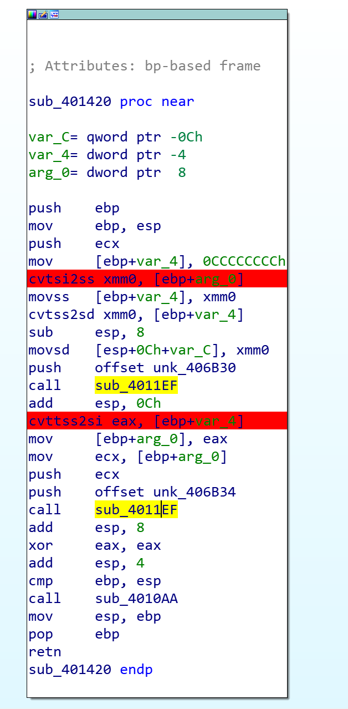

In this section, let's use CMake to manage our project.

## 2.2.0.float
I don't know why no crash on Visual Studio 2015 x86-debug when I input a float value in `scanf("%f", &nInt);` 

## 2.2.2.intToFloat
1. First of all, find the key function `printf` in IDA  ; and we'll get this result . And let's select the first one;

2. We can get the `main` function by finding the reference here . We can see `cvtsi2ss` and `cvttss2si` instruction although `fild`/`fst`/`fstp`/`fld` not found;